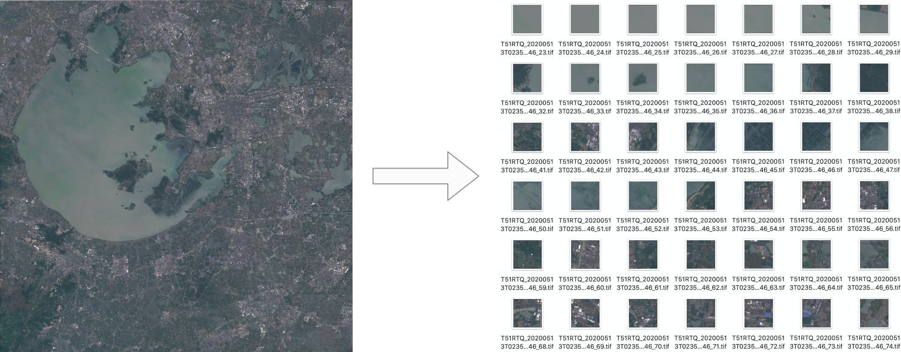

# Image Classification

This is classification turtorial for satellite image. We will use sentinal-2 TCI data as an example. It cover from training data prepare, train the model, and predict the new files.

## Prepare trainning data
Suppose we got a scene of sentinel-2 satellite TCI image data. You can download from [esa scihub](https://scihub.copernicus.eu/dhus/#/home). I has got the secene id `T51RTQ_20200513T023551_TCI` and convert the JPEG2000 to GeoTIFF.

1. patch the large 10980x10980 pixel image to 128x128 pixel image

```

    ➜ cd  tests/classification/      
    ➜ ts make-mask-cls --filepath T51RTQ_20200513T023551_TCI.tif --width 128 --height 128 --outpath ./patched
    processing 1/1 file T51RTQ_20200513T023551_TCI.tif ...
    14%|███████████████▉                                                              | 12/85 [00:07<00:45,  1.60it/s]
```
You should get the following data:



2. **labeling the train data and test data**  

You can split the data into tran data and test data as below. And then labeling those patched image into four classes: `water`, `residential`, `farmland`, `forest`. Reorganize the catalog of these small images according to different categories and split them to train and validation dataset.
```
    .
    ├── train
    │    ├── water
    │    │   ├── T51RTQ_20200513T023551_TCI_1_29.tif
    │    │   ├── T51RTQ_20200513T023551_TCI_2_29.tif
    │    │   └── ...
    │    ├── frameland
    │    │   ├── T51RTQ_20200513T023551_TCI_3_2.tif
    │    │   ├── T51RTQ_20200513T023551_TCI_11_1.tif
    │    │   └── ...
    │    ├── residential
    │    │   ├── T51RTQ_20200513T023551_TCI_0_29.tif
    │    │   ├── T51RTQ_20200513T023551_TCI_1_37.tif
    │    │   └── ...
    │    ├── forest
    │    │   ├── T51RTQ_20200513T023551_TCI_7_21.tif
    │    │   ├── T51RTQ_20200513T023551_TCI_22_45.tif
    │    │   └── ...
    ├── validation
    │    ├── water
    │    │   ├── T51RTQ_20200513T023551_TCI_5_32.tif
    │    │   ├── T51RTQ_20200513T023551_TCI_5_12.tif
    │    │   └── ...
    │    ├── frameland
    │    │   ├── T51RTQ_20200513T023551_TCI_9_2.tif
    │    │   ├── T51RTQ_20200513T023551_TCI_6_76.tif
    │    │   └── ...
    │    ├── residential
    │    │   ├── T51RTQ_20200513T023551_TCI_8_29.tif
    │    │   ├── T51RTQ_20200513T023551_TCI_3_37.tif
    │    │   └── ...
    │    ├── forest
    │    │   ├── T51RTQ_20200513T023551_TCI_8_12.tif
    │    │   ├── T51RTQ_20200513T023551_TCI_31_5.tif
    │    │   └── ...
```

## Training model
You can use the `scipts/train_cls.py` to train your classification model.
Here is a train examples, for more parameter information, please use `python3 train_cls.py help` to view.
```bash
python3 train_cls.py --train-path ./classification/train \
                 --val-path ./tests/classification/val \
                 --model resnet18 \
                 --batch-size 16 \
                 --num-classes 4 \
                 --device cuda 
```
It should start train and the console will print the training logs.

```
Train Epoch: 0 [0/1514 (0%)]    Loss: 1.878198
Train Epoch: 0 [160/1514 (11%)] Loss: 0.811605
Train Epoch: 0 [320/1514 (21%)] Loss: 0.774963
Train Epoch: 0 [480/1514 (32%)] Loss: 0.817051
Train Epoch: 0 [640/1514 (42%)] Loss: 0.869388
Train Epoch: 0 [800/1514 (53%)] Loss: 4.763704
Train Epoch: 0 [960/1514 (63%)] Loss: 0.968885
Train Epoch: 0 [1120/1514 (74%)] Loss: 4.856205
Train Epoch: 0 [1280/1514 (84%)] Loss: 1.343379
Train Epoch: 0 [1440/1514 (95%)] Loss: 0.551179

Test set: Average loss: 16.4018, Accuracy: 68/326 (21%)

Train Epoch: 1 [0/1514 (0%)]    Loss: 2.768502
Train Epoch: 1 [160/1514 (11%)] Loss: 0.424574
Train Epoch: 1 [320/1514 (21%)] Loss: 0.572497
Train Epoch: 1 [480/1514 (32%)] Loss: 1.539173
Train Epoch: 1 [640/1514 (42%)] Loss: 0.707925
Train Epoch: 1 [800/1514 (53%)] Loss: 0.545577
Train Epoch: 1 [960/1514 (63%)] Loss: 0.956915
Train Epoch: 1 [1120/1514 (74%)] Loss: 0.556552
Train Epoch: 1 [1280/1514 (84%)] Loss: 0.825140
Train Epoch: 1 [1440/1514 (95%)] Loss: 0.588212

Test set: Average loss: 0.4656, Accuracy: 254/326 (78%)

Train Epoch: 2 [0/1514 (0%)]    Loss: 0.422114
Train Epoch: 2 [160/1514 (11%)] Loss: 0.273431
Train Epoch: 2 [320/1514 (21%)] Loss: 0.505005
....
```

You can also open Tensorboard to view the loss and test accuracy during training.


And we provide lots of classification model, and all of them support multi-channel(>4) tiff image as input.
- VGG: `vgg11`, `vgg11_bn`, `vgg13`, `vgg13_bn`, `vgg16`, `vgg16_bn`, `vgg19_bn`, `vgg19`
- ResNet: `resnet18`, `resnet34`, `resnet50`, `resnet101`, `resnet152`, `resnext50_32x4d`,`'resnext101_32x8d`, `wide_resnet50_2`, `wide_resnet101_2`
- DenseNet: `densenet121`, `densenet169`, `densenet201`
- Inception: `inception_v3`
- MobileNet: `mobilenet_v2`
- EfficientNet: `efficientnet_b0`, `efficientnet_b1`, `efficientnet_b2`, `efficientnet_b3`,`'efficientnet_b4`, `efficientnet_b5`, `efficientnet_b6`, `efficientnet_b7`
- ResNeSt: `resnest50`, `resnest101`, `resnest200`, `resnest269`

## Inference new image
[TODO]